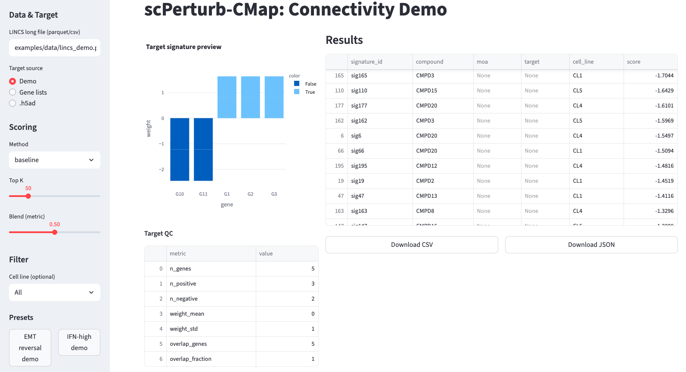
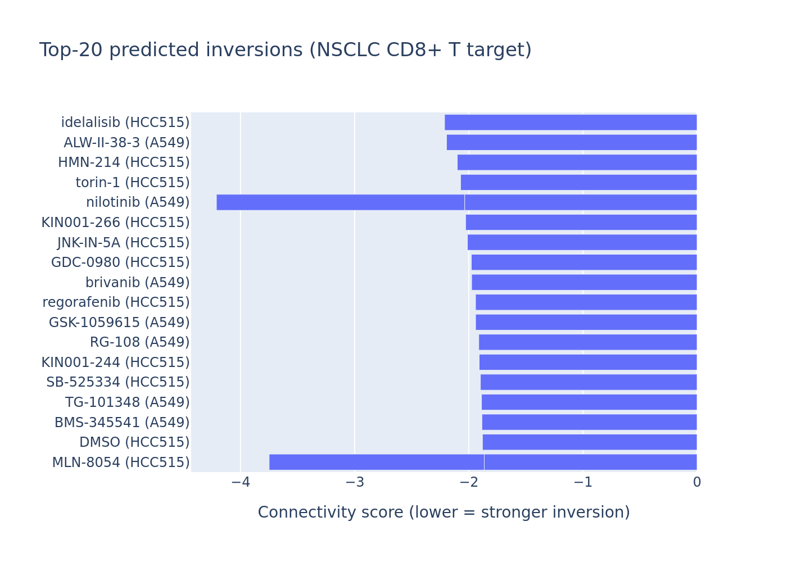

# scPerturb-CMap

_From single-cell disease signatures to ranked drug repurposing hypotheses—within hours._

The Broad Connectivity Map (LINCS L1000) captures millions of empirically measured drug responses. scPerturb-CMap is the bridge that lets single-cell researchers mine that atlas without rebuilding perturbation screens from scratch. Starting with a troublesome or rare cell population (e.g., EMT-like tumor cells, IFN-high macrophages, exhausted T cells), you derive a gene signature and immediately query the L1000 treasury for compounds proven to push cells in the opposite direction. In place of months-long screening campaigns, you generate ordered, testable drug hypotheses the same day—complete with effect sizes, z-scores, p-values, QC stats, and mechanism-of-action enrichments.

Under the hood, scPerturb-CMap blends a fast statistical baseline with a learned DualEncoder metric model trained on known inversion pairs. This machine learning component learns embeddings for targets and perturbations and is blended with the baseline at inference to sharpen ranking accuracy.

Why use scPerturb-CMap:
1. **Targets the “undruggable.”** Rare states no longer disappear in bulk averages; ranking is driven by the exact cluster causing pathology.
2. **Leverages a decade of data.** Mine the public L1000 archive before expensive single-cell perturbation experiments.
3. **Accelerates repurposing.** Connect patient-derived or experimental signatures to approved/investigational compounds with immediate readouts for bench validation.
4. **Democratises analysis.** Fits existing workflows (AnnData `.h5ad`, curated gene lists, LINCS Parquet), and ships with CLI, Python API, and Streamlit UI for mixed computational/experimental teams.

#### How scPerturb-CMap differs from scGen / scPerturb

| Feature | **scGen / scPerturb** | **scPerturb-CMap** |
| :-- | :-- | :-- |
| Primary question | *“If I apply perturbation X, what will my single-cell transcriptomes look like?”* | *“Given this disease signature, which known compounds have been observed to reverse it?”* |
| Core capability | Learns perturbation rules within a reference single-cell dataset and predicts new responses. | Searches the external LINCS L1000 atlas to retrieve real perturbations ranked by inversion strength. |
| Required inputs | A single-cell experiment that already contains the perturbation of interest (treated vs control). | A target signature from scRNA-seq (`.h5ad`) or curated up/down gene lists; optional custom LINCS-style libraries. |
| Outputs | Simulated single-cell expression profiles under hypothetical perturbations. | Ranked list of real compounds with connectivity scores, z/p statistics, QC metrics, and MOA enrichment. |
| Analogy | **Flight simulator** – models how a plane behaves under new conditions. | **Flight search engine** – scans all existing routes to find the optimal therapeutic “flight” toward reversal. |

The package ships with:

- a fast baseline (cosine + GSEA ensemble) that emits z-scores and p-values,
- a DualEncoder metric model that can be trained on real inversion pairs,
- CLI utilities for LINCS ingestion, target construction, scoring, and training,
- a Streamlit UI for interactive analysis.

---

## Table of Contents
1. [Concept Overview](#concept-overview)
2. [Feature Highlights](#feature-highlights)
3. [Quickstart](#quickstart)
4. [Command-Line Essentials](#command-line-essentials)
5. [Training on Real Inversion Pairs](#training-on-real-inversion-pairs)
6. [Preparing LINCS L1000 Data](#preparing-lincs-l1000-data)
7. [Streamlit UI](#streamlit-ui)
8. [Acceptance & Quality Gates](#acceptance--quality-gates)
9. [Development Workflow](#development-workflow)
10. [HPC Notes](#hpc-notes)
11. [License](#license)

---

## Concept Overview

Traditional connectivity mapping averages bulk transcriptomes and may miss rare cell states. scPerturb-CMap instead works with single-cell targets:

```
  scRNA-seq (.h5ad) ──► build target signature (genes, weights)
                              │
                              ▼
  LINCS long-form library ──► score (baseline | metric blend) ──► ranked drugs
```

Supported data contracts:
- **Target** (`TargetSignature` JSON): `{"genes": [...], "weights": [...], "metadata": {...}}`
- **LINCS long** (Parquet/CSV/TSV): `signature_id, compound, cell_line, gene_symbol, score` (+ optional `moa, target, replicate_id`, etc.)
- **Results** (Parquet/CSV): `signature_id, compound, cell_line, score, moa?, target?`

---

## Feature Highlights

- **Baseline ensemble** – cosine connectivity + GSEA, exported with z-scores and double-sided p-values.
- **Metric learning** – DualEncoder trained with NT-Xent or triplet loss on real or synthetic inversion pairs; blended with the baseline at inference.
- **Replicate-aware preprocessing** – optional MODZ collapsing (`--collapse-replicates`) when `replicate_id` is present.
- **Target engineering** – pseudobulk grouping (`--pseudobulk-key`), QC summaries (gene balance, overlap with LINCS), and JSON/CSV exports.
- **Pair generation helpers** – utilities under `scperturb_cmap.data.pairs` to sample positives/negatives from LINCS metadata.
- **Rich analytics** – Streamlit UI exposing target QC, MOA enrichment bars, and cell-line heatmaps.

---

### How the model works

I encode the target signature and each LINCS signature into a shared embedding space using a DualEncoder trained on known inversion pairs (contrastive/triplet losses). Similarity in this space estimates reversal strength. At inference, I blend the learned metric with the statistical baseline (configurable or auto-tuned) to yield robust, accurate rankings.

---

## Quickstart

```bash
# Create a local virtual environment and install the package + dev extras
make setup

# Generate synthetic demo LINCS + AnnData assets
make demo

# Score the demo target against the demo library (writes examples/out/results.parquet)
scperturb-cmap score \
  --target-json examples/out/target.json \
  --library examples/data/lincs_demo.parquet \
  --collapse-replicates \
  --method baseline \
  --top-k 50 \
  --output examples/out/results.parquet

# Launch the Streamlit dashboard
make ui

# Run short synthetic training + evaluation loops
make train
make evaluate

# Developer hygiene
make lint
make test
```

> **Python**: 3.10+ is required. All commands above assume GNU Make and a POSIX shell.

---

## Command-Line Essentials

| Command | Purpose |
| --- | --- |
| `scperturb-cmap make-target` | Build a target signature from `.h5ad` clusters or explicit gene lists. Options include `--pseudobulk-key`, `--qc-report`, and `--library-genes` to capture QC context. |
| `scperturb-cmap prepare-lincs` | Convert Level 5 GCTX to long-form LINCS tables, apply landmark filters, join MOA/target annotations, and optionally partition by `cell_line`. |
| `scperturb-cmap score` | Score a target against a LINCS library using `baseline` or `metric` methods. Supports rich filtering (`--cell-line(s)`, `--moa(s)`, `--dose-range`, `--touchstone`), replicate collapsing, and Parquet output. |
| `scperturb-cmap train` | Train the DualEncoder. With `pairs_path`, `targets_path`, and `library_path` the trainer uses real inversion data; otherwise, it falls back to synthetic toy data. |
| `scperturb-cmap device` / `scperturb-cmap diagnose` | Quick checks for device availability and environment diagnostics. |

Python APIs mirror the CLI; see `src/scperturb_cmap` for modules such as `api.score`, `data.pairs`, and `models.train`.

---

## Training on Real Inversion Pairs

1. **Assemble positives**: create a table with at least `target_id` and `signature_id`. Use `prepare_pair_table(...)` to attach negatives or supply a `label` column (1 = inversion, 0 = non-inversion).
2. **Export target JSON Lines**: each record must include `target_id`, `genes`, and `weights`. The CLI generator (`make-target --qc-report`) can write both the JSON target and a QC summary.
3. **Train**:

```bash
scperturb-cmap train \
  pairs_path=/path/to/pairs.parquet \
  targets_path=/path/to/targets.jsonl \
  library_path=/path/to/lincs_long.parquet \
  negatives_per_target=5 \
  epochs=10 \
  batch_size=128
```

The trainer auto-infers the gene dimension, logs metrics in `artifacts/metrics.json`, and writes `artifacts/best.pt`. You can point scoring runs to that checkpoint via `--method metric --model-path artifacts/best.pt`.

---

## Preparing LINCS L1000 Data

Use the built-in converter when you have raw Level 5 assets:

```bash
# Optional landmark extraction
scperturb-cmap landmarks \
  --gene-info /path/to/gene_info.txt \
  --output data/l1000_landmarks.txt

# GCTX ➜ Parquet (partitioned by cell_line for predicate pushdown)
scperturb-cmap prepare-lincs \
  --gctx /path/to/GSE92742_Broad_LINCS_Level5_COMPZ.MODZ.gctx \
  --gene-info /path/to/gene_info.txt \
  --sig-info /path/to/GSE92742_Broad_LINCS_sig_info.txt.gz \
  --repurposing /path/to/repurposing_drugs.tsv \
  --landmarks \
  --partition-by cell_line \
  --output data/lincs/lincs_level5_landmark_long
```

Tips:
- Supply `--landmarks-file` to reuse an existing 978-gene list; otherwise the converter derives one.
- For very large libraries, prefer `--partition-by cell_line` and use `--cell-lines` during scoring to leverage Arrow predicate pushdown.
- A validation script (`python scripts/validators/validate_parquet_dataset.py --dataset …`) summarizes partition counts and schema consistency.

---

## Streamlit UI

`make ui` launches a browser app that:
- loads the demo LINCS table by default (override with `--lincs <path>` or `SCPC_LINCS`),
- allows target creation from gene lists or uploaded `.h5ad` files,
- visualises the target signature and QC metrics,
- runs scoring (baseline or metric) with the same filtering options as the CLI,
- displays ranked results alongside MOA enrichment bars and heatmaps,
- supports CSV/JSON exports.

Example top-20 predicted inversions (NSCLC CD8+ T target):


---

## Acceptance & Quality Gates

The project defines three acceptance checks:
1. Baseline scoring on the demo completes in <60 seconds and emits z-scores/p-values.
2. A short DualEncoder training run improves recall@50 by ≥10 percentage points over the untrained model.
3. The Streamlit UI can load the demo dataset and export ranked results.

Run them together:

```bash
make acceptance
```

The script scores the demo, materialises `examples/out/metric_dataset/` (synthetic but structured like real inversion pairs), trains the DualEncoder against those files, and ensures recall@5 improves by ≥10 percentage points.

---

## Development Workflow

- **Linting & tests**: `make lint`, `make test`
- **Acceptance harness**: `make acceptance`
- **CI**: GitHub Actions installs the project via `make setup` then runs lint + tests.
- **Code style**: formatted/checked with Ruff (line length ≤100). Python 3.10 target version.

Contributions welcome—see `CONTRIBUTING.md` for detailed guidance.

---

## HPC Notes

Cluster-specific setup, Slurm examples, and environment hints live in [`docs/hpc.md`](docs/hpc.md). In short:
- `make hpc-setup` provisions an environment (Conda if available, otherwise venv).
- `scripts/*.sbatch` provide job templates for data conversion, scoring, training, and UI tunnels.
- Respect site-specific module requirements (e.g., load CUDA before launching GPU jobs).

---

## License

MIT License – see [`LICENSE`](LICENSE).
