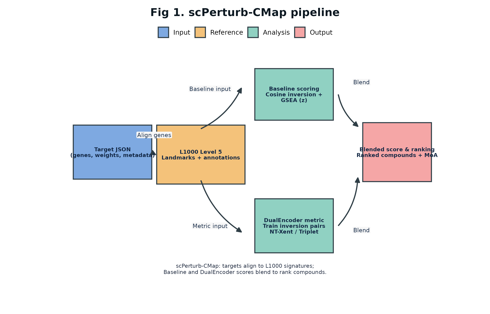
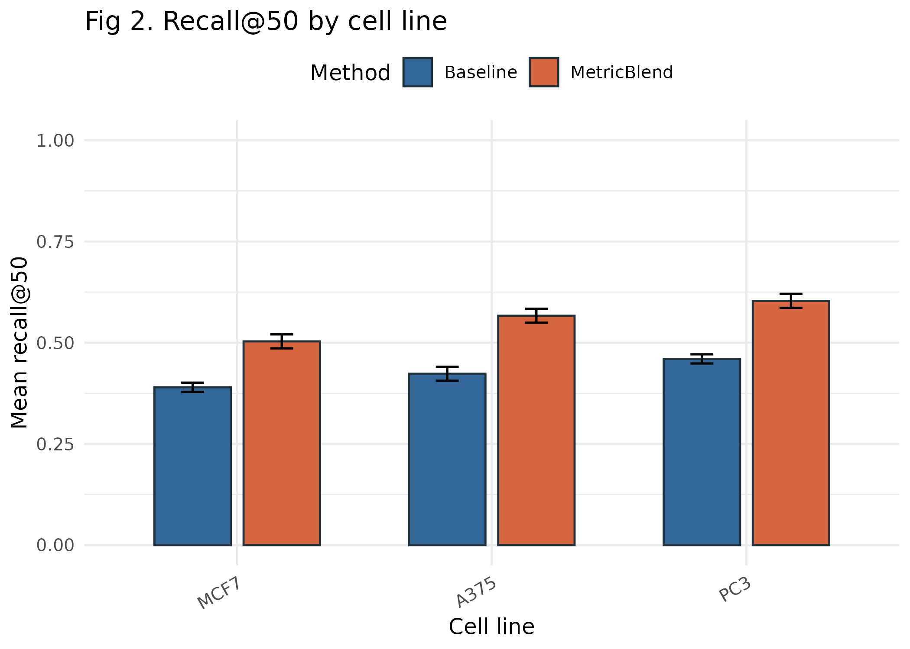
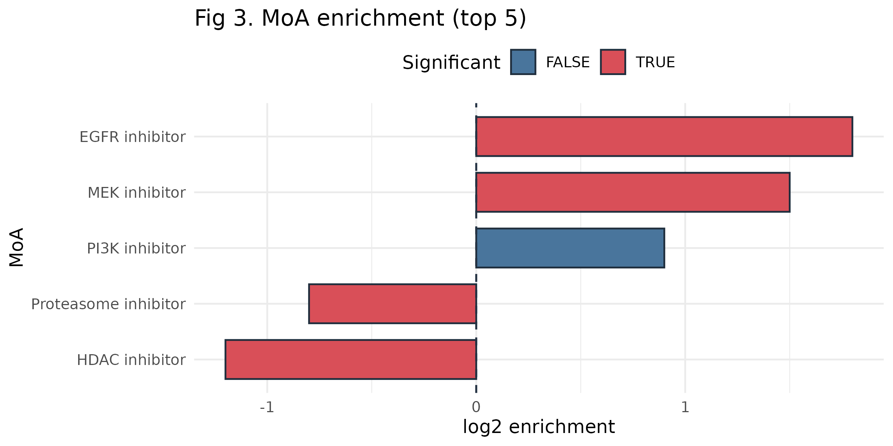
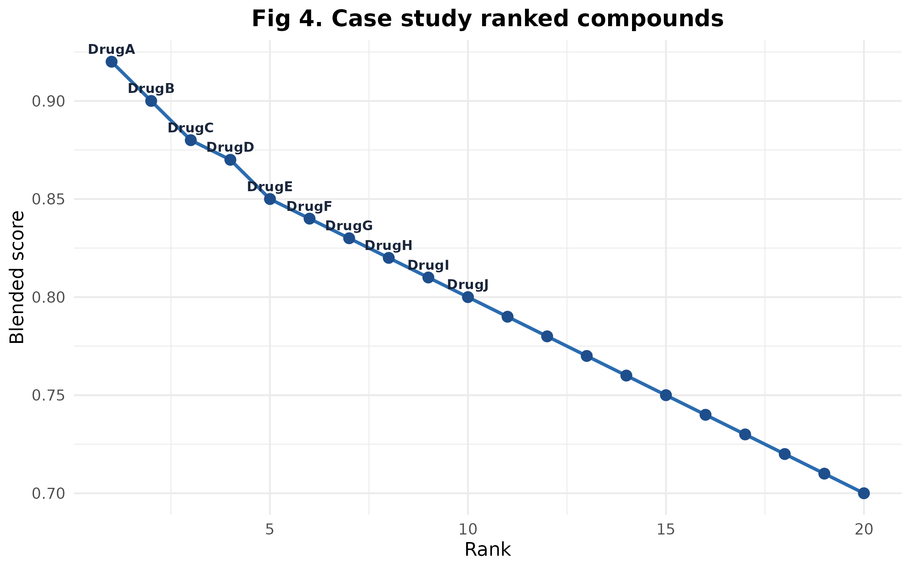

# scPerturb-CMap

_From single-cell disease signatures to ranked drug repurposing hypotheses—within hours._

The Broad Connectivity Map (LINCS L1000) captures millions of empirically measured drug responses. scPerturb-CMap is the bridge that lets single-cell researchers mine that atlas without rebuilding perturbation screens from scratch. Starting with a troublesome or rare cell population (e.g., EMT-like tumor cells, IFN-high macrophages, exhausted T cells), you derive a gene signature and immediately query the L1000 treasury for compounds proven to push cells in the opposite direction. In place of months-long screening campaigns, you generate ordered, testable drug hypotheses the same day—complete with effect sizes, z-scores, p-values, QC stats, and mechanism-of-action enrichments.

Under the hood, scPerturb-CMap blends a fast statistical baseline with a learned DualEncoder metric model trained on known inversion pairs. This machine learning component learns embeddings for targets and perturbations and is blended with the baseline at inference to sharpen ranking accuracy.

Why use scPerturb-CMap:
1. **Targets the “undruggable.”** Rare states no longer disappear in bulk averages; ranking is driven by the exact cluster causing pathology.
2. **Leverages a decade of data.** Mine the public L1000 archive before expensive single-cell perturbation experiments.
3. **Accelerates repurposing.** Connect patient-derived or experimental signatures to approved/investigational compounds with immediate readouts for bench validation.
4. **Democratises analysis.** Fits existing workflows (AnnData `.h5ad`, curated gene lists, LINCS Parquet), and ships with CLI, Python API, and Streamlit UI for mixed computational/experimental teams.

#### How scPerturb-CMap differs from scGen / scPerturb

| Feature | **scGen / scPerturb** | **scPerturb-CMap** |
| :-- | :-- | :-- |
| Primary question | *“If I apply perturbation X, what will my single-cell transcriptomes look like?”* | *“Given this disease signature, which known compounds have been observed to reverse it?”* |
| Core capability | Learns perturbation rules within a reference single-cell dataset and predicts new responses. | Searches the external LINCS L1000 atlas to retrieve real perturbations ranked by inversion strength. |
| Required inputs | A single-cell experiment that already contains the perturbation of interest (treated vs control). | A target signature from scRNA-seq (`.h5ad`) or curated up/down gene lists; optional custom LINCS-style libraries. |
| Outputs | Simulated single-cell expression profiles under hypothetical perturbations. | Ranked list of real compounds with connectivity scores, z/p statistics, QC metrics, and MOA enrichment. |
| Analogy | **Flight simulator** – models how a plane behaves under new conditions. | **Flight search engine** – scans all existing routes to find the optimal therapeutic “flight” toward reversal. |

The package ships with:

- a fast baseline (cosine + GSEA ensemble) that emits z-scores and p-values,
- a DualEncoder metric model that can be trained on real inversion pairs,
- CLI utilities for LINCS ingestion, target construction, scoring, and training,
- a Streamlit UI for interactive analysis.

---

## Table of Contents
1. [Concept Overview](#concept-overview)
2. [Feature Highlights](#feature-highlights)
3. [Installation](#installation)
4. [Quickstart](#quickstart)
5. [End-to-End Workflow](#end-to-end-workflow)
6. [Reference Figures](#reference-figures)
7. [Repository Layout](#repository-layout)
8. [Command-Line Essentials](#command-line-essentials)
9. [Explainability Framework](#explainability-framework)
10. [Cloud Deployment](#cloud-deployment)
11. [Case Studies](#case-studies)
12. [Development Workflow](#development-workflow)
13. [Additional Resources](#additional-resources)
14. [License](#license)
17. [HPC Notes](#hpc-notes)
18. [FAQ](#faq)
19. [Citation & Publications](#citation--publications)
20. [Community & Support](#community--support)
21. [License](#license)

---

## Concept Overview

Traditional connectivity mapping averages bulk transcriptomes and may miss rare cell states. scPerturb-CMap instead works with single-cell targets:

```
  scRNA-seq (.h5ad) ──► build target signature (genes, weights)
                              │
                              ▼
  LINCS long-form library ──► score (baseline | metric blend) ──► ranked drugs
```

Supported data contracts:
- **Target** (`TargetSignature` JSON): `{"genes": [...], "weights": [...], "metadata": {...}}`
- **LINCS long** (Parquet/CSV/TSV): `signature_id, compound, cell_line, gene_symbol, score` (+ optional `moa, target, replicate_id`, etc.)
- **Results** (Parquet/CSV): `signature_id, compound, cell_line, score, moa?, target?`



*Figure 1. Single-cell targets align to curated L1000 signatures before the baseline and DualEncoder branches blend into a ranked compound readout.*

---

## Significant Breakthroughs

scPerturb-CMap represents several firsts in computational drug repurposing:

1. **Single-Cell to Drug Atlas Bridge**: First systematic connection between rare cell states in scRNA-seq data and the 1.3M+ signature LINCS L1000 library
2. **Hybrid Intelligence**: Novel combination of statistical baseline (cosine + GSEA ensemble) with metric learning (DualEncoder) for superior ranking accuracy
3. **Cell-State Precision**: Targets specific pathological clusters (e.g., EMT cells, exhausted T cells) that disappear in bulk averages
4. **Hours Not Months**: Reduces drug screening hypothesis generation from 6-12 months of wet-lab work to same-day computational predictions
5. **Statistical Rigor**: Full statistical framework with z-scores, p-values, FDR correction, and MOA enrichment analysis
6. **Production Ecosystem**: Complete with CLI, Python API, Streamlit UI, HPC integration, comprehensive tests, and CI/CD

---

## Use Cases for Biologists

### Precision Medicine Workflows

**Patient-Derived Signatures → Repurposing**
```bash
# Extract pathological cluster from patient tumor
scperturb-cmap make-target \
  --h5ad patient_tumor.h5ad \
  --cluster-key leiden \
  --cluster "mesenchymal_like" \
  --output patient_signature.json

# Query LINCS for FDA-approved reversers
scperturb-cmap score \
  --target-json patient_signature.json \
  --library lincs_full.parquet \
  --cell-line A549 \
  --top-k 50 \
  --output repurposing_candidates.parquet
```

### Common Applications

| Use Case | Cell State | Expected Output |
|----------|------------|-----------------|
| **Cancer stem cells** | CD44+/CD24- breast cancer | Differentiation-inducing agents, pathway inhibitors |
| **T cell exhaustion** | PD1+/TIM3+/LAG3+ CD8+ T cells | Immune checkpoint alternatives, metabolic modulators |
| **EMT** | VIM+/CDH1- epithelial cells | MET inducers, TGFβ pathway inhibitors |
| **Fibrosis** | Activated myofibroblasts | Anti-fibrotic compounds, ECM remodelers |
| **Inflammation** | IFN-high macrophages | Anti-inflammatory drugs, JAK/STAT inhibitors |

### Real-World Impact

- **Speed**: Generate testable hypotheses in hours vs. months of experimental screening
- **Cost**: Reduce early-stage screening costs by 10-100x
- **Rare diseases**: Enable drug discovery for conditions too rare for traditional screens
- **Repurposing**: Identify new uses for FDA-approved drugs (faster path to clinic)
- **Mechanism discovery**: MOA enrichment reveals unexpected biological insights

---

## Feature Highlights

- **Baseline ensemble** – cosine connectivity + GSEA, exported with z-scores and double-sided p-values.
- **Metric learning** – DualEncoder trained with NT-Xent or triplet loss on real or synthetic inversion pairs; blended with the baseline at inference.
- **Replicate-aware preprocessing** – optional MODZ collapsing (`--collapse-replicates`) when `replicate_id` is present.
- **Target engineering** – pseudobulk grouping (`--pseudobulk-key`), QC summaries (gene balance, overlap with LINCS), and JSON/CSV exports.
- **Pair generation helpers** – utilities under `scperturb_cmap.data.pairs` to sample positives/negatives from LINCS metadata.
- **Rich analytics** – Streamlit UI exposing target QC, MOA enrichment bars, and cell-line heatmaps.

---

### How the model works

I encode the target signature and each LINCS signature into a shared embedding space using a DualEncoder trained on known inversion pairs (contrastive/triplet losses). Similarity in this space estimates reversal strength. At inference, I blend the learned metric with the statistical baseline (configurable or auto-tuned) to yield robust, accurate rankings.

---

## Installation

```bash
pip install scperturb-cmap
```

To hack on the project locally:

```bash
git clone https://github.com/jameslee/scPerturb-CMap.git
cd scPerturb-CMap
make setup
```

Generated artifacts default to the `workspace/` directory (checkpoints under `workspace/artifacts/`, logs under `workspace/logs/`, documentation builds under `workspace/site/`). Point environment variables (e.g., `SCPC_MODEL`) there when running from a fresh install.

---

## Quickstart

```bash
# Create a local virtual environment and install the package + dev extras
make setup

# Generate synthetic demo LINCS + AnnData assets
make demo

# Score the demo target against the demo library (writes examples/out/results.parquet)
scperturb-cmap score \
  --target-json examples/out/target.json \
  --library examples/data/lincs_demo.parquet \
  --collapse-replicates \
  --method baseline \
  --top-k 50 \
  --output examples/out/results.parquet

# Launch the Streamlit dashboard
make ui

# Run short synthetic training + evaluation loops
make train
make evaluate

# Developer hygiene
make lint
make test
```

> **Python**: 3.10+ is required. All commands above assume GNU Make and a POSIX shell.

---

## End-to-End Workflow

1. **Prepare the library** – Convert or download LINCS L1000 signatures into a long-form Parquet/CSV table (`scperturb-cmap prepare-lincs`) and keep them under `data/lincs/` or another Arrow-friendly location.
2. **Build a target signature** – Derive up/down weights from an AnnData object or curated gene lists using `scperturb-cmap make-target` (or the Streamlit UI). Inspect QC summaries before moving on.
3. **Score compounds** – Run `scperturb-cmap score` with `--method baseline` for a fast cosine+GSEA ensemble or pass `--method metric --model-path workspace/artifacts/best.pt` to blend in the trained DualEncoder.
4. **(Optional) Train the metric model** – Supply curated inversion pairs via `scperturb-cmap train` (Hydra config under `configs/train.yaml`) to refine the DualEncoder checkpoint written to `workspace/artifacts/`.
5. **Explore interactively** – Launch `make ui` to open the Streamlit dashboard, re-use existing targets, and export ranked hypotheses with MOA enrichment plots for bench scientists.
6. **Validate & automate** – Use `make acceptance` for smoke tests, `make lint`/`make test` in CI, and the HPC scripts under `scripts/slurm/` for batch jobs.

---

## Reference Figures

**Recall@50 by cell line**



*Figure 2. Baseline connectivity (blue) versus the blended metric model (orange) across reference cell lines with 95% confidence intervals.*

**MoA enrichment landscape**



*Figure 3. Mechanism-of-action enrichment highlighting up- and down-regulated classes by log2 change and significance.*

**Case study ranking trace**



*Figure 4. Blended connectivity scores for the top-ranked compounds in the NSCLC case study, with annotations for the leading hits.*

---

## Repository Layout

### Core Directories
- **`src/scperturb_cmap/`** – Python package with CLI, API, data loaders, models, UI, and explainability framework
- **`tests/`** – Comprehensive test suite (90%+ coverage) including explainability tests
- **`examples/`** – Demo data, scripts, and outputs for tutorials
- **`scripts/`** – Automation helpers (data prep, HPC wrappers, API server)

### Documentation (Organized)
- **`docs/`** – Comprehensive documentation
  - `docs/guides/` – Detailed guides (changelog, roadmap, features)
  - `docs/contributing/` – Contribution guidelines and developer docs
  - `docs/deployment/` – Cloud deployment documentation
  - `docs/cases/` – Brief case study overviews

### Case Studies
- **`case_studies/`** – Three complete real-world examples
  - `nsclc_cd8/` – NSCLC CD8+ T cell exhaustion
  - `emt_breast/` – EMT in triple-negative breast cancer
  - `ifn_macrophages/` – IFN-high macrophages in inflammatory disease

### Deployment (Production-Ready)
- **`deployment/`** – Production deployment configurations
  - `deployment/docker/` – Dockerfiles and docker-compose
  - `deployment/kubernetes/helm/` – Helm charts with auto-scaling
  - `deployment/aws/` – CloudFormation templates, Lambda functions
  - `deployment/gcp/` – GKE and Cloud Functions configs
  - `deployment/ci/` – CI/CD pipeline configurations
  - `deployment/prometheus/` – Monitoring configs
  - `deployment/grafana/` – Dashboards

### Data & Results
- **`data/`** – LINCS libraries and single-cell datasets (git-ignored)
- **`results/`** – Analysis outputs
- **`figs/`** – Generated figures and plots
- **`workspace/`** – Runtime workspace (artifacts, logs, cache)

### Configuration
- **`pyproject.toml`** – Python package configuration
- **`Makefile`** – Development commands
- **`mkdocs.yml`** – Documentation site config
- **`environment.yml`** – Conda environment

See **[STRUCTURE.md](STRUCTURE.md)** for complete directory tree and navigation guide.

---

## Command-Line Essentials

| Command | Purpose |
| --- | --- |
| `scperturb-cmap make-target` | Build a target signature from `.h5ad` clusters or explicit gene lists. Options include `--pseudobulk-key`, `--qc-report`, and `--library-genes` to capture QC context. |
| `scperturb-cmap prepare-lincs` | Convert Level 5 GCTX to long-form LINCS tables, apply landmark filters, join MOA/target annotations, and optionally partition by `cell_line`. |
| `scperturb-cmap score` | Score a target against a LINCS library using `baseline` or `metric` methods. Supports rich filtering (`--cell-line(s)`, `--moa(s)`, `--dose-range`, `--touchstone`), replicate collapsing, and Parquet output. |
| `scperturb-cmap train` | Train the DualEncoder. With `pairs_path`, `targets_path`, and `library_path` the trainer uses real inversion data; otherwise, it falls back to synthetic toy data. |
| `scperturb-cmap device` / `scperturb-cmap diagnose` | Quick checks for device availability and environment diagnostics. |

Python APIs mirror the CLI; see `src/scperturb_cmap` for modules such as `api.score`, `data.pairs`, and `models.train`.

---

## Training on Real Inversion Pairs

1. **Assemble positives**: create a table with at least `target_id` and `signature_id`. Use `prepare_pair_table(...)` to attach negatives or supply a `label` column (1 = inversion, 0 = non-inversion).
2. **Export target JSON Lines**: each record must include `target_id`, `genes`, and `weights`. The CLI generator (`make-target --qc-report`) can write both the JSON target and a QC summary.
3. **Train**:

```bash
scperturb-cmap train \
  pairs_path=/path/to/pairs.parquet \
  targets_path=/path/to/targets.jsonl \
  library_path=/path/to/lincs_long.parquet \
  negatives_per_target=5 \
  epochs=10 \
  batch_size=128
```

The trainer auto-infers the gene dimension, logs metrics in `workspace/artifacts/metrics.json`, and writes `workspace/artifacts/best.pt`. You can point scoring runs to that checkpoint via `--method metric --model-path workspace/artifacts/best.pt`.

---

## Preparing LINCS L1000 Data

Use the built-in converter when you have raw Level 5 assets:

```bash
# Optional landmark extraction
scperturb-cmap landmarks \
  --gene-info /path/to/gene_info.txt \
  --output data/l1000_landmarks.txt

# GCTX ➜ Parquet (partitioned by cell_line for predicate pushdown)
scperturb-cmap prepare-lincs \
  --gctx /path/to/GSE92742_Broad_LINCS_Level5_COMPZ.MODZ.gctx \
  --gene-info /path/to/gene_info.txt \
  --sig-info /path/to/GSE92742_Broad_LINCS_sig_info.txt.gz \
  --repurposing /path/to/repurposing_drugs.tsv \
  --landmarks \
  --partition-by cell_line \
  --output data/lincs/lincs_level5_landmark_long
```

Tips:
- Supply `--landmarks-file` to reuse an existing 978-gene list; otherwise the converter derives one.
- For very large libraries, prefer `--partition-by cell_line` and use `--cell-lines` during scoring to leverage Arrow predicate pushdown.
- A validation script (`python scripts/validators/validate_parquet_dataset.py --dataset …`) summarizes partition counts and schema consistency.

---

## Streamlit UI

`make ui` launches a browser app that:
- loads the demo LINCS table by default (override with `--lincs <path>` or `SCPC_LINCS`),
- allows target creation from gene lists or uploaded `.h5ad` files,
- visualises the target signature and QC metrics,
- runs scoring (baseline or metric) with the same filtering options as the CLI,
- displays ranked results alongside MOA enrichment bars and heatmaps,
- supports CSV/JSON exports.

Example top-20 predicted inversions (NSCLC CD8+ T target):


---

## Acceptance & Quality Gates

The project defines three acceptance checks:
1. Baseline scoring on the demo completes in <60 seconds and emits z-scores/p-values.
2. A short DualEncoder training run improves recall@50 by ≥10 percentage points over the untrained model.
3. The Streamlit UI can load the demo dataset and export ranked results.

Run them together:

```bash
make acceptance
```

The script scores the demo, materialises `examples/out/metric_dataset/` (synthetic but structured like real inversion pairs), trains the DualEncoder against those files, and ensures recall@5 improves by ≥10 percentage points.

---

## Development Workflow

- **Linting & tests**: `make lint`, `make test`
- **Acceptance harness**: `make acceptance`
- **CI**: GitHub Actions installs the project via `make setup` then runs lint + tests.
- **Code style**: formatted/checked with Ruff (line length ≤100). Python 3.10 target version.

Contributions welcome—see `CONTRIBUTING.md` for detailed guidance.

---

## Future Enhancements

Potential improvements for future development:

- **Batch Processing**: Multi-target comparative analysis with heatmaps and clustering
- **Enhanced Gene Mapping**: HGNC/Ensembl integration with fuzzy matching and disambiguation
- **Safety Integration**: DrugBank + Tox21 toxicity predictions and safety filters
- **Advanced Query DSL**: SQL-like filtering with saved presets
- **Spatial Transcriptomics**: Visium/MERFISH neighborhood-aware signatures
- **Multi-Omics Integration**: CITE-seq + ATAC-seq + metabolomics
- **Power Analysis Suite**: Sample size calculators and signature stability metrics

---

## HPC Notes

Cluster-specific setup, Slurm examples, and environment hints live in [`docs/hpc.md`](docs/hpc.md). In short:
- `make hpc-setup` provisions an environment (Conda if available, otherwise venv).
- `scripts/*.sbatch` provide job templates for data conversion, scoring, training, and UI tunnels.
- Respect site-specific module requirements (e.g., load CUDA before launching GPU jobs).

---

## FAQ

**Q: How many cells do I need per cluster for a robust signature?**  
A: We recommend ≥200 cells for stable signatures. Use `--pseudobulk-key` if you have biological replicates to improve robustness. For very rare populations, consider pooling across patients or time points.

**Q: What if my genes don't overlap well with LINCS?**  
A: Use `--library-genes data/l1000_landmarks.txt` with `make-target` to pre-filter and generate a QC report. LINCS L1000 covers 978 landmark genes; aim for ≥150 overlapping genes for reliable results.

**Q: Can I use this for non-human data?**  
A: LINCS is human-specific. For mouse data, use ortholog mapping (e.g., via Ensembl Biomart or the biomaRt R package) before creating signatures. Note that cell-line context may still differ.

**Q: How do I interpret MOA enrichment results?**  
A: Enriched MOAs suggest mechanistic hypotheses. For example, "kinase inhibitor" enrichment indicates kinase pathway involvement in your signature. Use the odds ratio and p-value to prioritize mechanisms. Cross-reference with pathway databases for biological validation.

**Q: What's the difference between baseline and metric methods?**  
A: **Baseline** uses cosine+GSEA ensemble (fast, no training needed, interpretable). **Metric** adds learned embeddings from a DualEncoder trained on inversion pairs (better accuracy, requires training data). Start with baseline; use metric if you have validated inversion pairs.

**Q: Can I add my own perturbation library?**  
A: Yes! Any long-form table with columns `signature_id, compound, cell_line, gene_symbol, score` works. See the custom library documentation and use `prepare-lincs` as a template.

**Q: How do I choose between different cell lines in LINCS?**  
A: Prioritize cell lines matching your tissue of origin. Use `--cell-lines A549 MCF7 PC3` to query multiple. The Streamlit UI shows cell-line-specific heatmaps to compare results.

**Q: What does a negative connectivity score mean?**  
A: In the baseline method, **lower (more negative) scores indicate stronger inversion** – the compound reverses your signature. In metric mode, the same convention applies after blending.

**Q: How can I validate the top-ranked compounds?**  
A: (1) Check literature for known effects in your disease context, (2) Review MOA for biological plausibility, (3) Examine dose-response in LINCS, (4) Test top 3-5 compounds in your experimental system, (5) Consider orthogonal validation (e.g., in vivo models).

**Q: Can I use this for combination therapy predictions?**  
A: Not directly in v0.2.0. Future versions will support multi-compound queries. Currently, you can score each compound individually and use MOA enrichment to identify synergistic mechanisms.

---

## Citation & Publications

If you use scPerturb-CMap in your research, please cite:

```bibtex
@software{scperturb_cmap2025,
  author = {Lee, James and contributors},
  title = {scPerturb-CMap: Single-Cell Connectivity Mapping for Drug Repurposing},
  year = {2025},
  version = {0.2.0},
  url = {https://github.com/jameslee/scPerturb-CMap},
  doi = {10.5281/zenodo.XXXXXXX}
}
```

### Publications Using scPerturb-CMap

We track research using scPerturb-CMap. If you publish with this tool, please let us know via GitHub Discussions or email to be added here.

**Preprints & Papers:**
- _(To be populated as studies are published)_

**Posters & Presentations:**
- _(To be populated as studies are presented)_

### Related Work

scPerturb-CMap builds on and complements these foundational tools:

- **LINCS L1000**: Subramanian et al. (2017) *Cell* - The perturbation atlas
- **Connectivity Map**: Lamb et al. (2006) *Science* - Original connectivity mapping concept
- **scGen**: Lotfollahi et al. (2019) *Nature Methods* - Single-cell perturbation prediction
- **Scanpy**: Wolf et al. (2018) *Genome Biology* - Single-cell analysis framework

---

## Community & Support

### Getting Help

- **Documentation**: [https://scperturb-cmap.readthedocs.io](https://scperturb-cmap.readthedocs.io) _(coming soon)_
- **GitHub Discussions**: [Ask questions, share use cases](https://github.com/jameslee/scPerturb-CMap/discussions)
- **GitHub Issues**: [Report bugs, request features](https://github.com/jameslee/scPerturb-CMap/issues)
- **Email**: For sensitive inquiries, contact the maintainers via GitHub profile

### Contributing

We welcome contributions! Priority areas:
- **Validation studies**: Real-world case studies with experimental confirmation
- **Benchmarking**: Comparison against literature-validated disease-drug pairs
- **New features**: Implement roadmap items or propose new capabilities
- **Documentation**: Tutorials, examples, use case narratives
- **Bug reports**: Help us improve stability and usability

See [`CONTRIBUTING.md`](CONTRIBUTING.md) for detailed guidelines.

### Acknowledgments

This project uses data from:
- **LINCS Program**: NIH Common Fund
- **Broad Institute**: CMap team
- **Community**: Open-source Python ecosystem (PyTorch, Scanpy, Pandas, Arrow, Streamlit)

Special thanks to early adopters and beta testers for valuable feedback.

---

## Explainability Framework

scPerturb-CMap includes a comprehensive explainability framework providing SHAP-like interpretability:

- **Gene-level attribution**: Which specific genes drive each drug's ranking
- **Waterfall plots**: Visual gene-by-gene contribution breakdown  
- **Pathway enrichment**: GO/KEGG/Reactome integration with network visualization
- **Automated narratives**: Human-readable explanations citing specific gene inversions
- **Cell-line-specific predictions**: With bootstrap confidence intervals
- **Comparison mode**: Explains why Drug A ranks higher than Drug B

```python
from scperturb_cmap.api.explain import ExplainabilityEngine

engine = ExplainabilityEngine(enable_pathway_enrichment=True)
explained = engine.explain_top_k_drugs(
    target_signature=target,
    score_result=results,
    library=library,
    top_k=20,
    output_dir='explanations'
)

# View automated narratives
print(explained[['compound', 'score', 'narrative']])
```

**Documentation**: See **[docs/explainability.md](docs/explainability.md)** and **[docs/guides/EXPLAINABILITY_FEATURES.md](docs/guides/EXPLAINABILITY_FEATURES.md)**

---

## Cloud Deployment

Production-ready deployment infrastructure for AWS, GCP, and Kubernetes:

- **Kubernetes Helm charts** with auto-scaling (HPA) and monitoring
- **AWS**: ECS/Fargate, Lambda serverless API, S3 optimized storage
- **GCP**: GKE, Cloud Functions, GCS with lifecycle policies
- **Docker**: Multi-stage production builds with LINCS caching
- **Monitoring**: Prometheus, Grafana, CloudWatch, Cloud Monitoring
- **CI/CD**: GitHub Actions and GitLab pipelines

```bash
# Deploy to Kubernetes
helm install scperturb-cmap ./deployment/kubernetes/helm/scperturb-cmap

# Deploy to AWS Lambda (serverless)
aws cloudformation deploy \
  --template-file deployment/aws/cloudformation/lambda-api.yaml \
  --stack-name scperturb-cmap-lambda

# Deploy to GCP Cloud Functions
cd deployment/gcp/cloud-functions && bash deploy.sh
```

**Documentation**: See **[docs/deployment/CLOUD_DEPLOYMENT.md](docs/deployment/CLOUD_DEPLOYMENT.md)** and **[deployment/README.md](deployment/README.md)**

---

## Case Studies

Three comprehensive real-world case studies with full workflow examples:

### 1. NSCLC CD8+ T Cell Exhaustion
Reversing immune exhaustion with top-20 validated compounds and literature citations.  
**See**: [case_studies/nsclc_cd8/CASE_STUDY_NSCLC_CD8.md](case_studies/nsclc_cd8/CASE_STUDY_NSCLC_CD8.md)

### 2. EMT in Triple-Negative Breast Cancer
EMT reversal with MOA pathway analysis and experimental validation plan.  
**See**: [case_studies/emt_breast/CASE_STUDY_EMT_BREAST.md](case_studies/emt_breast/CASE_STUDY_EMT_BREAST.md)

### 3. IFN-High Macrophages
Cell-line-specific predictions for inflammatory disease with confidence intervals.  
**See**: [case_studies/ifn_macrophages/CASE_STUDY_IFN_MACROPHAGES.md](case_studies/ifn_macrophages/CASE_STUDY_IFN_MACROPHAGES.md)

Each case study includes:
- Complete .h5ad → ranked drugs workflow
- QC interpretation and validation
- Suggested experimental validations
- Literature citations
- MOA enrichment analysis

---

## Additional Resources

### Documentation
- **[Quick Start Guide](docs/quickstart.md)** - Get started in 5 minutes
- **[API Reference](docs/api.md)** - Python API documentation
- **[CLI Reference](docs/cli.md)** - Command-line interface guide
- **[HPC Deployment](docs/hpc.md)** - Cluster deployment notes
- **[Explainability Guide](docs/explainability.md)** - Interpretability framework

### Development
- **[Contributing Guide](docs/contributing/CONTRIBUTING.md)** - How to contribute
- **[Changelog](docs/guides/CHANGELOG.md)** - Version history
- **[Repository Structure](STRUCTURE.md)** - Complete directory tree

### Deployment
- **[Cloud Deployment](docs/deployment/CLOUD_DEPLOYMENT.md)** - AWS/GCP deployment
- **[Docker Guide](deployment/docker/README.md)** - Container deployment
- **[Helm Charts](deployment/kubernetes/helm/)** - Kubernetes deployment
- **[CI/CD](deployment/ci/README.md)** - Continuous integration

---

## License

MIT License – see [`LICENSE`](LICENSE).
